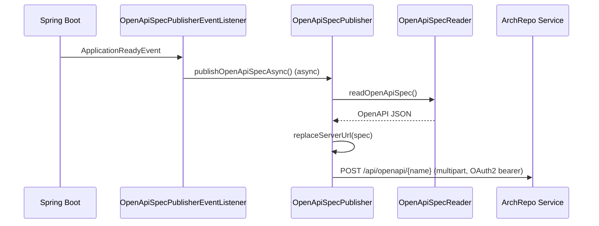

# How it works

The publisher hooks into the Spring Boot lifecycle to read and upload the OpenAPI specification once the
application is ready, without affecting business logic or startup time.

## Startup flow

1. `OpenApiSpecPublisherEventListener` listens for the Spring `ApplicationReadyEvent`.
2. It calls `OpenApiSpecPublisher.publishOpenApiSpecAsync()`, which is `@Async` on a dedicated
   single-thread task executor (`openApiSpecPublisherTaskExecutor`, core pool size 0, max 1, queue
   capacity 1). The upload therefore runs in the background and never blocks startup.
3. `OpenApiSpecReader` reads the OpenAPI JSON from springdoc's `OpenApiResource` (via a synthesised
   request built by `HttpServletRequestFactory`).
4. `BaseServerUrlReplacer` optionally rewrites the spec's base server URL (see below).
5. The spec is wrapped in a `ByteArrayResource` named `<spring.application.name>-open-api-spec.json` and
   posted to the archrepo at `POST /api/openapi/{systemComponentName}` as `multipart/form-data`, with the
   system component name set to `spring.application.name` and a `version` request parameter.
6. The operation is optionally wrapped by `TracingTimer` in a Micrometer span (`publish-open-api-spec`)
   and timer (`jeap-publish-open-api-spec`, tagged `status=success|error`) when a `Tracer` and
   `MeterRegistry` are present.

The whole upload is best-effort: failures are logged (`Failed to publish OpenAPI spec`) and the
application keeps running.

## Base server URL replacement

The OpenAPI document generated at startup describes the local server (`http://localhost:8080/`). To make
the published spec point at the deployed service, `BaseServerUrlReplacer` replaces that base URL with
`https://<fqdn><context-path>` when:

- `jeap.archrepo.replace-base-server-url` is `true` (the default), and
- the FQDN property named by `jeap.archrepo.service-fqdn-property` (default
  `aws.services.route53.internal_csp_fqdn`) resolves to a value in the environment.

The context path is taken from `server.servlet.context-path`. If no FQDN is configured the spec is
uploaded unchanged.

## App version

The `version` sent with the upload is resolved from `BuildProperties` if available, otherwise from
`GitProperties` (`git.build.version`), falling back to `na` if neither is present.

## Related

- [Getting started](getting-started.md)
- [Configuration reference](configuration.md)
- [Authentication](authentication.md)
- [jeap-open-api-publisher-starter](../README.md)
